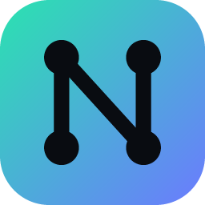

# Better GFN Neural 1.0

**GeForce NOW の映像を、あなたの PC の GPU でリアルタイムに高画質化する非公式コンパニオンアプリ（Windows 10 / 11 64-bit）**

> ⚠️ 本アプリは **NVIDIA 公式製品ではありません**。NVIDIA とは一切関係がなく、承認も受けていません。
> GeForce NOW のサーバー・認証・プラン・待機列・セッション時間・DRM・アンチチート・ゲームメモリには一切触れません。
> ローカル PC 上で「GeForce NOW ウィンドウの映像を取得 → GPU で画像処理 → 表示」だけを行います。

[English summary](#english-summary) ・ [アーキテクチャ](docs/ARCHITECTURE.md) ・ [機能詳細](docs/FEATURES.md) ・ [対応 GPU](docs/GPU_SUPPORT.md) ・ [テスト結果](docs/TEST_RESULTS.md) ・ [既知の問題](docs/KNOWN_ISSUES.md) ・ [ビルド方法](BUILDING.md)

---

## 使い方（ホットキー不要）

1. `BetterGFNNeural.exe` を起動（インストーラー版・ポータブル版どちらでも可）
2. 初回のみ 5 ステップの自動チェック（GPU → モニター → GeForce NOW → オートモード → 完了）が数秒で流れます
3. GeForce NOW でゲームを起動するだけ。アプリが自動で
   * GeForce NOW を検出 → ゲームウィンドウを検出（ウィンドウタイトルからゲーム名も自動認識）
   * 映像キャプチャ開始（Windows Graphics Capture、GPU 上でゼロコピー）
   * GPU 処理開始（圧縮ノイズ除去 → 時間方向安定化 → デブラー → Neural Super Resolution → アダプティブシャープ → HDR+/カラー → フレーム補間）
   * GeForce NOW の上に、クリック透過の出力ウィンドウとして最適化映像を表示
4. GeForce NOW が起動していない場合は、ホーム画面の **「GeForce NOWを起動」** ボタンで起動できます

キーボードショートカットは一切不要です。設定はすべて GUI から変更でき、通常は **Auto（オートモード）** のままで最適な設定が自動選択されます。マウス・キーボード・コントローラー入力はそのまま GeForce NOW に届きます（出力ウィンドウはクリック透過・非アクティブ化）。

## 主な機能

| 機能 | 内容 |
|---|---|
| **AUTO MODE**（標準 ON） | GPU 処理時間(p95)・VRAM 予算・GPU/CPU 使用率・入出力 FPS・リフレッシュレート・遅延を常時監視し、7 段階の品質ティアとフレーム補間をリアルタイムに自動決定。性能不足時は強化を止めずに段階的に品質を下げて FPS を維持 |
| **Neural Super Resolution** | 本プロジェクトで学習した CNN（S: 1,540 / L: 7,700 パラメータ）を HLSL コンピュートシェーダーで実行。720p→1080p、1080p→1440p、1080p→4K、1440p→4K。出力はモニター解像度に自動追従。モード: Auto / Quality / Balanced / Performance / Native。GFN がフルスクリーンで自前拡大している場合は**実際のストリーム解像度を自動検出**して再構成 |
| **Temporal Reconstruction** | オプティカルフローで履歴を動き補償、YCoCg 分散クリップでゴースト抑制。Temporal Anti-Flicker / Stabilization / Edge Stability / Ghosting Reduction（静止部の文字・フェンス・草・遠景を特に安定化） |
| **Stream Compression Cleanup** | ブロックノイズ / マクロブロック、バンディング（カラーバンディング）、モスキートノイズ、圧縮ノイズ、暗部ノイズの低減 + 出力ディザ |
| **AI Deblur** | エッジ帯域とディテール帯域を分けた適応デブラー + オプティカルフロー方向のモーションデブラー（高速移動時は自動で弱める） |
| **Adaptive Sharpening** | 静止時はディテール強化、高速移動時は抑制、文字/HUD は鮮明化、肌色（顔）は輪郭強調を抑制、オーバーシュート制限でハロー防止 |
| **フレーム補間** | オプティカルフローによる双方向動き補償補間（30→60 / 60→120 / 120→240）。Off / Auto / 2x。Auto は遅延予算内でのみ有効。静止した HUD/UI は補間せずそのまま表示 |
| **Low Latency Mode**（標準 ON） | フレーム待ち行列 1、待機可能スワップチェーン、新しいフレームを即時表示、補間の遅延予算を厳格化 |
| **HDR+ / SDR Enhancement** | HDR モニター: SDR 映像のハイライトをピーク輝度まで拡張（HDR+）／HDR ストリームはそのまま HDR 出力。SDR モニター: 黒/白レベル、コントラスト、ガンマ、彩度、自然な彩度、色温度、ハイライト復元、シャドウディテール、ローカルコントラスト、トーンマッピング。Auto はシーンのヒストグラムから黒潰れ・過剰彩度を避けて調整 |
| **ゲームプロファイル** | ウィンドウタイトル（例: `Cyberpunk 2077® on GeForce NOW`）からゲームを自動認識しプロファイル自動作成。Cyberpunk 2077 / Fortnite / Forza Horizon / Call of Duty / Minecraft / Apex Legends / Counter-Strike / Baldur's Gate 3 / The Witcher 3 / Rocket League の組み込みチューニング |
| **統計** | 入力/出力/キャプチャ FPS、入力・処理・出力解像度、処理時間(平均/p95/最大)、GPU 使用率、VRAM、フレーム時間、アップスケール方式、フレーム補間状態、ドロップフレーム、追加処理遅延、ステージ別 GPU 時間、オートモードの判断理由 |
| **ベンチマーク** | 合成クラウドゲームシーンで全パイプラインを全ティア実測。GPU、平均/最大処理時間、推奨プリセット・出力解像度・フレーム補間を表示し、ワンクリックで適用 |
| **その他** | タスクトレイ（待機中 / 接続済み / 強化中）、Windows 起動時に開始（バックグラウンド待機→自動処理）、Xbox / DualSense 等のコントローラー検出（読み取りのみ）、マルチモニター、モニター抜き差し・解像度変更・スリープ復帰・Alt+Tab 追従、GPU ドライバーリセットからの復旧、異常終了後のセーフモード、日本語 / 英語 UI |

詳細は [docs/FEATURES.md](docs/FEATURES.md) を参照してください。

## ダウンロード / 成果物

GitHub Actions（`build-test-package`）が毎回ビルド・テスト・パッケージングし、以下を成果物としてアップロードします:

* `BetterGFNNeural.exe` — 単体実行ファイル（静的 CRT、追加ランタイム不要）
* `BetterGFNNeuralSetup.exe` — インストーラー（ユーザー単位・管理者権限不要、スタートメニュー/デスクトップのショートカット、アンインストーラー）
* `BetterGFNNeural-1.0.0-portable.zip` — ポータブル版（設定とログを exe と同じフォルダに保存）

## 動作要件

* Windows 10 64-bit（1903 以降、推奨 21H2 以降）または Windows 11 64-bit
* Direct3D 11（Feature Level 11_0）対応 GPU。NVIDIA RTX 20/30/40/50・GTX、AMD Radeon RX、Intel Arc を想定（[対応 GPU 一覧](docs/GPU_SUPPORT.md)）
* GeForce NOW Windows アプリ（ブラウザ版の検出は設定でオプション）

## 設定ファイルとログ

* インストール版: `%LOCALAPPDATA%\BetterGFNNeural\settings.json`、`...\logs\`
* ポータブル版: exe と同じフォルダの `settings.json`、`logs\`
* ログレベル: Info / Warning / Error / Debug。Windows のユーザー名・プロファイルパス・PC 名は自動でマスクされ、アカウント情報は記録しません
* 設定は原子的に保存され `.bak` を保持。破損時はバックアップ → 既定値の順に復旧

## 技術的に不可能なこと・代替（正直な説明）

| 要望 | 不可能な理由 | 代替実装 |
|---|---|---|
| 本物の DLSS / "DLSS 5" | DLSS はゲームエンジン内部のモーションベクトル・深度・ジッターを必要とし、NVIDIA 公式 SDK とゲーム側の統合が必須。GeForce NOW のストリーム映像からは取得できない | 独自学習の **Neural Super Resolution**（CNN）＋ 映像から推定するオプティカルフローによる時間方向再構成。DLSS とは名乗りません |
| ニューラルネットによるフレーム生成 | 4K で低遅延のニューラル補間（RIFE 等）はミドルクラス GPU のリアルタイム予算を大きく超え、NVIDIA Optical Flow SDK は NVIDIA 専用 | GPU ベンダー非依存の **オプティカルフロー（階層ブロックマッチング）フレーム補間**。UI 上も「Frame Interpolation (Optical Flow)」と表記 |
| GFN 内部の解像度・HDR 情報の取得 | GFN の内部状態を読むには DLL 注入やメモリ読取が必要（禁止事項） | 映像の周波数解析による **ストリーム解像度の自動検出**、Windows の HDR 設定（DXGI / DisplayConfig）から HDR 状態を取得 |
| 真の可変リフレッシュレート(VRR)出力 | 出力はクリック透過のオーバーレイで、Windows のデスクトップコンポジターが合成する（独立フリップ不可） | DXGI のティアリング/VRR 対応状況を表示し、フレームペーシングをリフレッシュレートに合わせて最適化 |
| 顔の検出 | 実時間の顔検出モデルは負荷が高い | 肌色尤度による「肌の輪郭保護」でシャープ過多を抑制 |

## 既知の制限

[docs/KNOWN_ISSUES.md](docs/KNOWN_ISSUES.md) を参照してください（GeForce NOW のキャプチャ保護、ウィンドウ版での出力モード、カーソル表示など）。

## ライセンス

MIT License（[LICENSE](LICENSE)）。サードパーティ: Dear ImGui（MIT）、nlohmann/json（MIT）、stb（Public Domain/MIT）— [THIRD_PARTY_NOTICES.md](THIRD_PARTY_NOTICES.md)。
"NVIDIA"、"GeForce"、"GeForce NOW" は NVIDIA Corporation の商標です。

---

## English summary

Better GFN Neural is an **unofficial** companion for the GeForce NOW Windows app. It captures the GeForce NOW
game window (Windows Graphics Capture, zero CPU copies), post-processes it on your local GPU with Direct3D 11
compute shaders and shows the result in a click-through overlay exactly over GeForce NOW. Everything starts
automatically — no hotkeys.

Pipeline: stream compression cleanup → optical-flow temporal reconstruction → adaptive/motion deblur →
**Neural Super Resolution** (CNN trained for this project, runs in HLSL) → adaptive sharpening →
HDR+ / SDR color enhancement → optional optical-flow frame interpolation. **Auto Mode** continuously adapts a
7-level quality tier and interpolation to GPU time, VRAM, load, frame rates, refresh rate and latency.

It does **not** touch GeForce NOW servers, authentication, plans, queues, session limits, DRM, anti-cheat or game
memory, and it is not DLSS. See [docs/ARCHITECTURE.md](docs/ARCHITECTURE.md) and [BUILDING.md](BUILDING.md).
