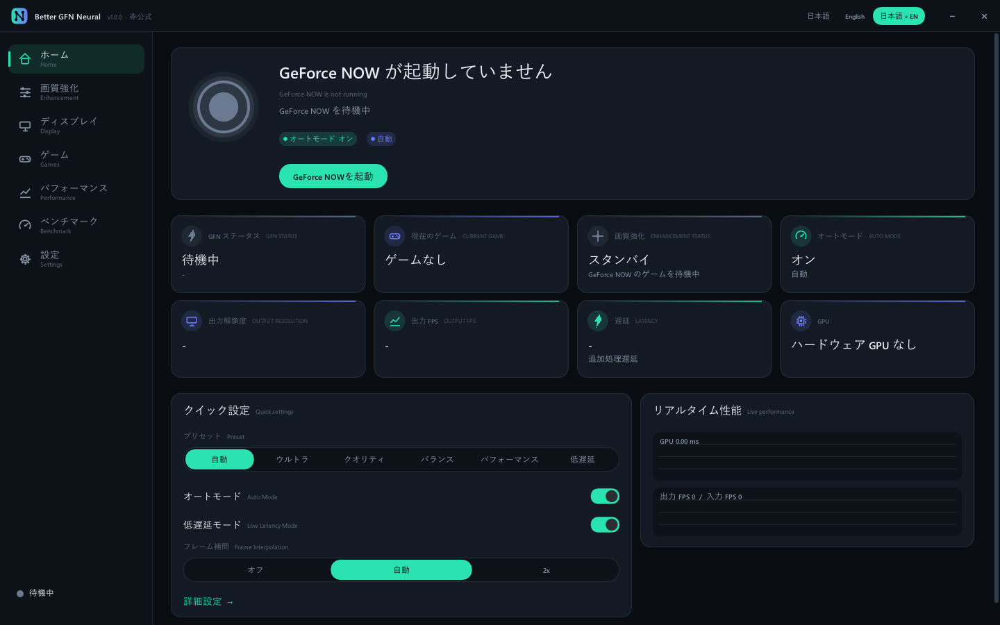
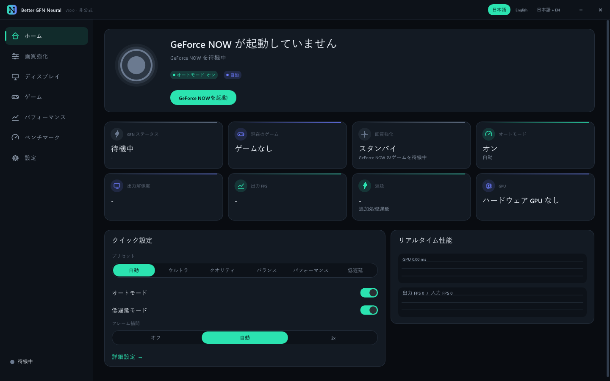
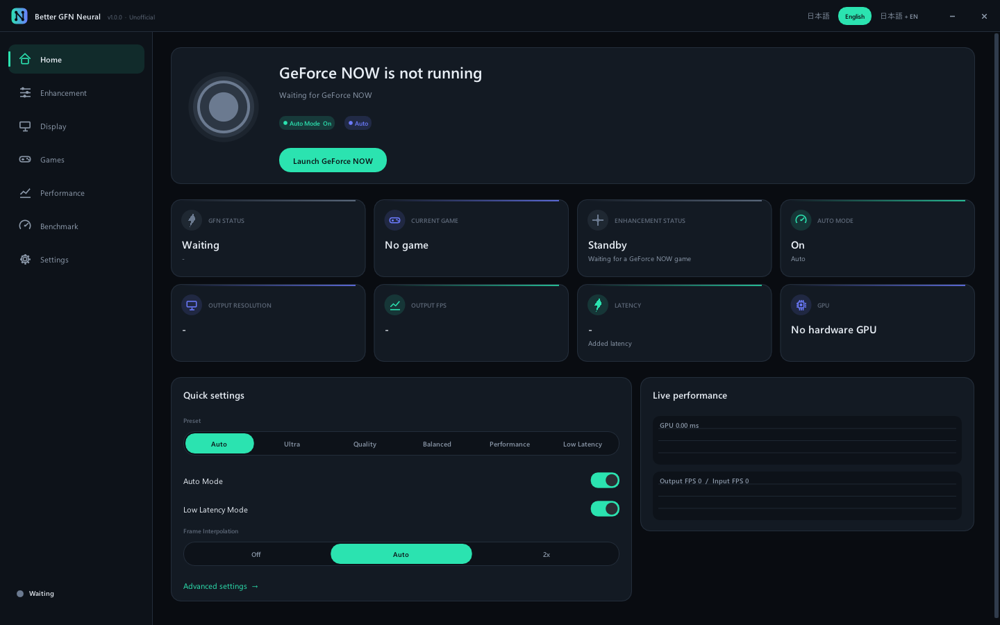

# テスト結果 / Test results — Better GFN Neural 1.0.0

**概要 (日本語)**
CI (GitHub Actions) 上で、ビルド・ユニットテスト・GPU セルフテスト・ベンチマーク・
統合テスト・パッケージ作成をすべて自動実行し、全項目が合格しています。
ただし CI ランナーには**ハードウェア GPU も GeForce NOW の実セッションもありません**。
GPU 処理は Direct3D 11 のソフトウェアラスタライザ (WARP) 上で、GeForce NOW の検出と
アプリ全体のライフサイクルは「GeForce NOW のふりをするテスト用ウィンドウ (FakeGfn)」で
検証しています。実 GPU での速度・実際の GFN ストリームでの画質は、ユーザー環境での
確認が必要です (末尾の [手動確認チェックリスト](#manual-verification-checklist) 参照)。

---

## Environment

| | |
|---|---|
| CI run | `build-test-package` run **#13** ([37399645118](https://github.com/runadeesu/Better-GFN-Neural/actions/runs/37399645118)), commit `ec78287` (later commits on the branch change documentation only) |
| Windows job | `windows-latest` GitHub-hosted runner, Visual Studio 2026 (MSVC 14.51), Windows SDK 10.0.26100, Ninja, Release, static CRT |
| VS 2022 job | `windows-2022`, "Visual Studio 17 2022" generator — compatibility build |
| Linux job | `ubuntu-latest`, GCC — portable core unit tests + NSR trainer build |
| GPU in CI | none — **Microsoft Basic Render Driver (WARP)**, feature level 12_1 exposed as D3D11, FP32 only (no FP16 shader path) |
| Monitor in CI | Hyper-V virtual display 1024×768 @ 64 Hz, SDR |

## Summary

| Stage | Result |
|---|---|
| Build — Windows x64 (VS 2026 toolset, Ninja) | ✅ |
| Build — Windows x64 (VS 2022 generator) | ✅ |
| Build — Linux portable core + NSR trainer | ✅ |
| HLSL shaders (fxc, 36 shaders, `/O3`) | ✅ compiled at build time; all 36 created on the device |
| Unit tests (`bgn_unit_tests`, 31 test cases) | ✅ 31 / 31 on Windows and Linux |
| GPU self-test (`--selftest --warp`) | ✅ all checks pass (details below) |
| Benchmark (`--benchmark --warp`) | ✅ completes, writes recommendation |
| Integration tests (real exe vs. fake GeForce NOW) | ✅ 21 / 21 checks |
| Packaging | ✅ `BetterGFNNeural.exe`, `BetterGFNNeuralSetup.exe`, portable ZIP, `SHA256SUMS.txt` |

## GPU self-test (WARP)

### Neural Super Resolution shader vs. CPU reference

The HLSL implementation of each trained network is compared with the C++ reference
implementation of the same weights (`src/neural/NsrReference.cpp`) on a test image.

| Model | Precision | Max abs error | Mean abs error | Result |
|---|---|---|---|---|
| nsr_s_x2 | FP32 | 0.0015 | 0.00020 | ✅ PASS |
| nsr_l_x2 | FP32 | 0.0014 | 0.00021 | ✅ PASS |

Tolerance: max 0.012 / mean 0.0015 (FP32), max 0.04 / mean 0.005 (FP16 — only run on GPUs
that support min16float; WARP does not, so the FP16 path is **not** covered by CI).

### Frame interpolation (optical flow)

Synthetic moving scene, interpolated middle frame compared with the true middle frame
(mean absolute error, lower is better):

| Method | MAE |
|---|---|
| Frame repeat (no interpolation) | 0.0231 |
| Naive 50/50 blend | 0.0201 |
| **Better GFN Neural optical-flow interpolation** | **0.0056** (3.6× lower than blending) — ✅ PASS |

### Temporal reconstruction

| Check | Measurement | Criterion | Result |
|---|---|---|---|
| Anti-flicker on a static scene with codec-like block flicker | frame-to-frame change 0.0025 → 0.0013 (**−47 %**) | reduction > 30 % | ✅ PASS |
| Ghosting during a fast pan (600 px/s) | deviation from the current frame 0.0045 vs. frame-to-frame change 0.0235 (19 %) | < 25 % | ✅ PASS |

### Pipeline: every quality tier × geometry

Each row runs all seven Auto Mode tiers (Minimal … Ultra) plus an HDR (scRGB FP16) output
pass and checks the output size, that every value is finite, within range and not black.
Numbers are WARP GPU milliseconds per frame (software rendering — 10–100× slower than a
real GPU; they only show relative cost).

| Input → output | Upscalers exercised | GPU ms, tiers 0…6 in order (extra HDR pass at tier 4) | Result |
|---|---|---|---|
| 320×180 → 640×360 | Fast Reconstruct (Lanczos-AR) / Neural SR (L) / Neural SR (S) | 58, 45, 47, 51, 51, 56 (HDR), 93, 95 | ✅ PASS |
| 480×270 → 480×270 | Native (no upscaling) | 32, 60, 53, 56, 56, 61 (HDR), 90, 86 | ✅ PASS |
| 320×180 → 800×450 | Fast Reconstruct (Lanczos-AR) / Neural SR (L) / Neural SR (S) | 55, 80, 62, 76, 75, 78 (HDR), 119, 115 | ✅ PASS |
| 400×225 → 640×360 | Fast Reconstruct (Lanczos-AR) / Neural SR (L) / Neural SR (S) | 45, 53, 57, 123, 121, 124 (HDR), 185, 186 | ✅ PASS |
| 640×360 → 640×360 (stream 180p inside) | Fast Reconstruct (Lanczos-AR) / Neural SR (L) / Neural SR (S) | 61, 71, 131, 80, 82, 81 (HDR), 115, 119 | ✅ PASS |

## Benchmark (WARP)

Input 480×270 → output 960×540, 8 measured frames per tier after 2 warm-up frames.

| Tier | Avg ms | Max ms |
|---|---|---|
| 0 Minimal | 105.0 | 198.6 |
| 1 Light | 84.4 | 93.5 |
| 2 Performance | 90.0 | 97.4 |
| 3 Balanced Lite | 97.0 | 97.6 |
| 4 Balanced | 99.8 | 104.8 |
| 5 Quality | 191.1 | 198.2 |
| 6 Ultra | 216.4 | 308.2 |

Frame interpolation pass: 16.2 ms. Recommendation on WARP: preset **Performance**,
frame interpolation **Off** (expected — a software renderer cannot hold any tier
inside a 60 fps budget, so the lowest tier is recommended; on real GPUs the same code
recommends higher tiers).

## Integration tests (fake GeForce NOW)

`tests/integration/run_integration.ps1` starts the real `BetterGFNNeural.exe` in
automation mode and drives `FakeGfn.exe` (renamed to `GeForceNOW.exe`; a GDI window
that animates a test pattern and follows a script: title changes with ®/™, resize,
fullscreen, windowed, minimize/restore, exit, restart).

| Check | Result | Detail |
|---|---|---|
| `app_exit_code` | ✅ PASS | exit code 0 |
| `report_written` | ✅ PASS | test-results\integration\detect.json |
| `initial_waiting` | ✅ PASS | first samples: Waiting,Waiting,Waiting,Waiting |
| `launcher_connected` | ✅ PASS | Connected samples: 29 |
| `game_detected_cyberpunk` | ✅ PASS | samples: 71 |
| `game_switch_fortnite` | ✅ PASS | samples: 20 |
| `gfn_exit_waiting` | ✅ PASS | states 42-44.5s: Waiting,Waiting,Waiting,Waiting,Waiting,Waiting,Waiting,Waiting,Waiting |
| `gfn_restart_reconnect` | ✅ PASS | samples: 34 |
| `profiles_created` | ✅ PASS | profiles: apexlegends,cyberpunk2077,fortnite |
| `capture_info` | ✅ PASS | max captured=163 presented=163 backends=Windows Graphics Capture capture sizes=960x540,1028x749,1024x768,1028x720 errors= |
| `settings_saved` | ✅ PASS | settings.json |
| `log_written` | ✅ PASS | logs folder |
| `log_privacy` | ✅ PASS | user name not present in logs |
| `crash_minidump` | ✅ PASS | dumps: 2 (expected one per crash) |
| `safe_mode_after_crashes` | ✅ PASS | safe_mode=True |
| `normal_after_clean_exit` | ✅ PASS | safe_mode=False |
| `corrupt_settings_survived` | ✅ PASS | exit code 0 |
| `corrupt_settings_rewritten` | ✅ PASS | settings.json valid again |
| `corrupt_settings_kept_for_diagnostics` | ✅ PASS | settings.json.corrupt |
| `ui_screenshots` | ✅ PASS | png files: 24 (English, Japanese, Japanese + English) |
| `ui_screenshots_japanese` | ✅ PASS | Japanese png files: 8 |

The capture line shows that **Windows Graphics Capture really captured and the overlay
really presented** the fake GFN window on the runner (`captured = presented`), across
window resizes and fullscreen.

### UI screenshots

Captured by the integration test (`--automation screenshots`) at 1440×900, 100 % DPI,
for every page (Home, Enhancement, Display, Games, Performance, Benchmark, Settings,
first-run wizard) in **English**, **日本語** and **日本語 + English** — 24 images in the
`test-results` artifact, a selection in [`docs/images/`](images/). Japanese text is
rendered with the Windows Japanese UI font (Yu Gothic / Meiryo) merged into the UI font.

| 日本語 + English | 日本語 | English |
|---|---|---|
|  |  |  |

## Packages

| File | Size | SHA-256 | Description |
|---|---|---|---|
| `BetterGFNNeural.exe` | 2,371,584 bytes | `757a51d5dafaf25b…` | stand-alone executable (x64, static CRT) |
| `BetterGFNNeuralSetup.exe` | 1,561,015 bytes | `d861f2ad37d12aab…` | NSIS installer, per-user, no admin rights |
| `BetterGFNNeural-1.0.0-portable.zip` | 1,918,853 bytes | `2acf38ef5ef06402…` | portable build (`portable.dat`: settings and logs next to the exe) |
| `SHA256SUMS.txt` | 281 bytes | — | checksums of the files above |

The exe is a 64-bit GUI binary that imports only Windows system DLLs (no Visual C++
runtime needed). The installer is **not code-signed** (SmartScreen may warn).

## Not covered by CI

| Area | Why not | How it is mitigated |
|---|---|---|
| Real NVIDIA / AMD / Intel GPU performance | runners have no GPU | WARP runs the same shaders; in-app Benchmark + Performance page on user PCs |
| FP16 (min16float) shader path | WARP has no FP16 support | Self-test checks it automatically on GPUs that support it |
| Real GeForce NOW app and stream | needs an NVIDIA account and a cloud session; not automatable in CI | Fake GFN window with the real window-title formats; detection is title/process/geometry based and does not touch GFN internals |
| HDR display output | runner display is SDR | HDR (scRGB FP16) path verified off-screen in the self-test |
| 120–240 Hz, VRR, multi-monitor hot-plug | single virtual 64 Hz display | Frame-pacing unit test; display change handling exercised by resize/fullscreen tests only |
| Controllers (Xbox / DualSense) | no devices | Detection is read-only (XInput / HID enumeration) |
| Sleep/resume, GPU driver reset (TDR) | cannot be triggered on a runner | Device-removed handling recreates the device and resumes; code reviewed, not executed in CI |

## Manual verification checklist

Run on a PC with a real GPU and a GeForce NOW account (Free, Performance or Ultimate —
the app only reads the picture on screen and works with any plan):

1. `BetterGFNNeural.exe --selftest --output selftest.json` → `"pass": true`
   (also checks the FP16 path when the GPU supports it).
2. Benchmark page → *Run benchmark*: recommended preset is plausible for the GPU
   (see [GPU_SUPPORT.md](GPU_SUPPORT.md)).
3. Start GeForce NOW from the Home page button → status changes Waiting → Connected.
4. Start a game → status *Enhancing*, game name and profile shown, overlay covers
   exactly the GFN video, mouse and controller input still go to GeForce NOW.
5. Split-compare (Display page) shows a visible difference; no flicker on static HUD
   elements; no ghosting behind fast-moving objects.
6. Performance page: added latency and GPU time are reasonable; Auto Mode lowers the
   tier when another GPU load is started and raises it again later.
7. Frame interpolation *Auto* on a 120 Hz+ monitor with a 60 fps stream → output fps
   ≈ 2× input fps; HUD text not warped.
8. Windows HDR on → HDR+ output, no clipped highlights; Windows HDR off → SDR output.
9. Alt+Tab away and back, change GFN window size, toggle GFN fullscreen, unplug a
   monitor, sleep/resume → app keeps running and re-attaches.
10. Quit GeForce NOW → overlay disappears, status returns to Waiting.
